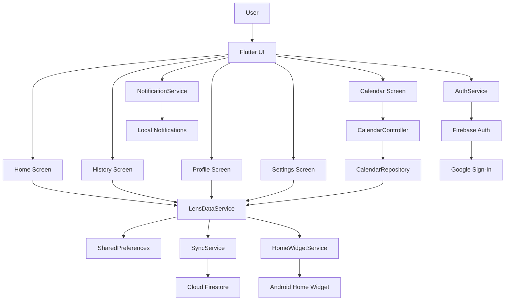
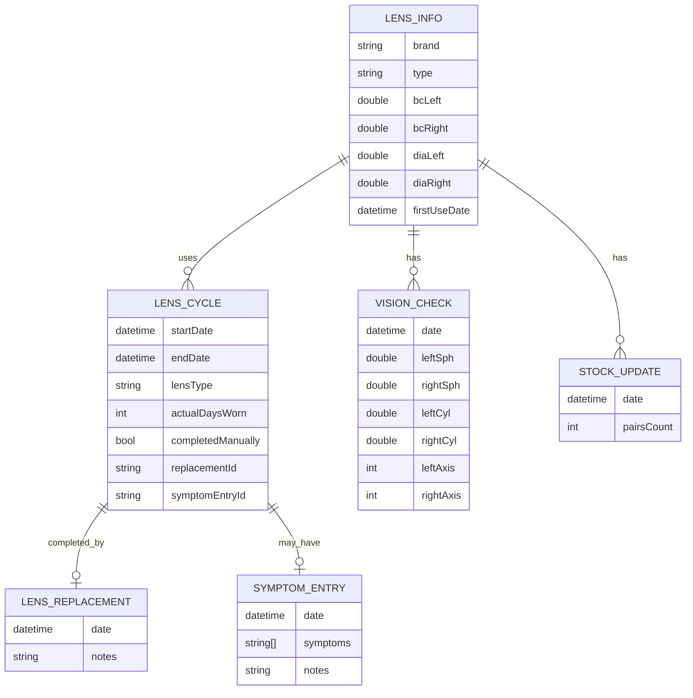

# Linsor

Linsor is a cross-platform Flutter application for tracking contact lens usage, replacement cycles, symptoms, lens stock, vision checks, and reminders.

The application helps users monitor how long they have been wearing their lenses, receive timely notifications, keep a history of lens cycles, and synchronize data across devices through Firebase.

<p align="center">
  
</p>

## Features

- Contact lens wearing cycle tracking
- Support for daily, weekly, bi-weekly, monthly, quarterly, and semi-annual lenses
- Replacement and removal reminders
- Daily care tips
- Low lens stock reminders
- Solution purchase reminders
- Lens stock management
- Wearing history
- Calendar view with lens events
- Symptom tracking
- Vision check records for left and right eye
- Google Sign-In
- Firebase synchronization
- Local offline-first data storage
- Light and dark themes
- Russian and English localization
- Android home widget

## Screenshots
| Home Light | Home Dark | Calendar |
|---|---|---|
|  |  |  |

| History | Profile | Settings |
|---|---|---|
|  |  |  |

| Notification | Android Widget |
|---|---|
|  |  |


## Platforms

The project is built with Flutter and contains platform support for:

- Android
- iOS
- Web
- Windows
- macOS
- Linux

Some features are platform-specific. For example, the Android home widget and Android notification actions are implemented for Android.

## Tech Stack

- Flutter
- Dart
- SharedPreferences
- Firebase Auth
- Google Sign-In
- Cloud Firestore
- Flutter Local Notifications
- Permission Handler
- Timezone
- Home Widget
- Flutter Localization
- Material 3

## Architecture

The application uses a service-oriented Flutter architecture with partial Clean Architecture principles in the calendar module.

Main layers:

- Presentation: screens, widgets, navigation
- Service/Application: data service, notification service, sync service, auth service
- Domain: lens models, cycles, symptoms, vision checks, calendar entities
- Data: SharedPreferences and Firestore
- Platform: Android widget and notification integrations



## Data Model



## Synchronization Strategy

The application follows a local-first approach.

Data is stored locally in SharedPreferences and can be synchronized with Cloud Firestore after Google Sign-In.

Current sync flow:

1. Local data is pushed to Firestore.
2. Cloud data is pulled back to the device.
3. Local storage is updated from the cloud response.

For first sign-in, if both local and cloud data exist, the user chooses which version to keep.

Conflict resolution for parallel edits on multiple devices is currently simplified. The latest successful cloud write becomes the actual version. Full entity-level merge is planned as a future improvement.

## Notifications

The application uses local notifications for:

- lens replacement reminders
- daily lens removal reminders for daily lenses
- care tips
- low stock reminders
- solution purchase reminders

For daily lenses, the app tracks a 14-hour wearing period.

For other lens types, the app calculates the next replacement date based on the selected lens type.

Android notifications support actions:

- I replaced them
- Remind me later

## Local Storage

The MVP version uses SharedPreferences for local data storage.

Stored data includes:

- lens information
- active lens cycle
- completed cycles
- symptoms
- vision checks
- lens stock
- notification settings
- language settings

In future versions, the local storage can be migrated to Hive or SQLite for more advanced querying and conflict resolution.

## Firebase

Firebase is used for:

- Google authentication
- user identity
- cloud data synchronization through Firestore

User data is stored in:

```text
users/{uid}
```

## Project Structure

```text
lib/
  main.dart
  models/
  services/
  screens/
  calendar/
    data/
    domain/
    presentation/
  theme/
  l10n/
  widgets/

android/
ios/
web/
windows/
macos/
linux/
```

## Getting Started

Install dependencies:

```bash
flutter pub get
```

Run the application:

```bash
flutter run
```

Run tests:

```bash
flutter test
```

## Firebase Setup

The project uses Firebase configuration from:

```text
lib/firebase_options.dart
android/app/google-services.json
```

If Firebase is not configured, the application can still work locally without cloud synchronization.

## Design

The application uses two visual themes:

- Light theme: Optical Vitality Framework / Translucent Clinician
- Dark theme: Vision Flow Dark / Neon Clinician

Theme implementation files:

```text
lib/theme/app_colors.dart
lib/theme/neon_theme.dart
lib/theme/app_theme.dart
lib/theme/action_palette.dart
```

## Status

This project is an MVP version of a contact lens monitoring application. It already includes core tracking, reminders, local storage, synchronization, localization, and Android widget functionality.
